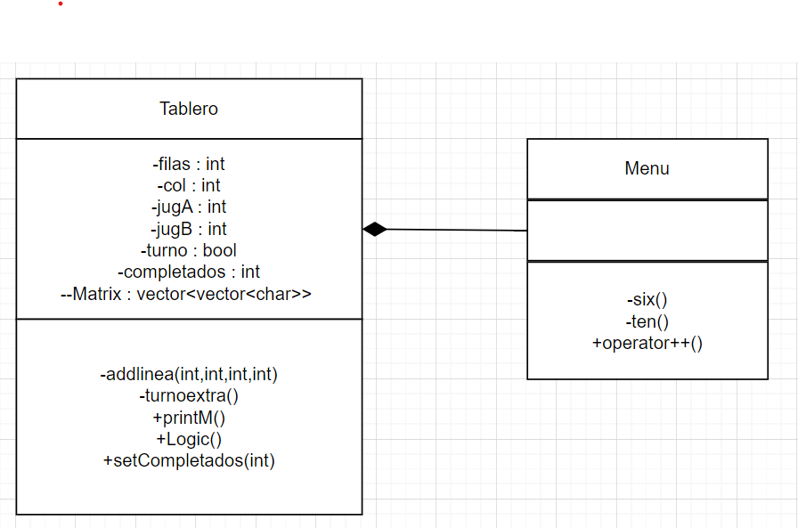

# DOTS AND BOXES - UTEC

## Integrantes: 

- Angie Gabriela Hurtado Mayhua - 202120008
- Carlos Felix Lhi - 202120214
- Jordan Ciril Enriquez Cachuan - 202210392
- Ivan Gonzales Saavedra - 202120237
- Eduardo Alexander Fernández Obregón - 202210129
- Jaquelin Milagros Paredes Quispe - 202120422
- Ricardo Adrian Lozano Acho - 202120328

---

## Descripcion: 
 
    Dots N Boxes es un juego entre 2 jugadores el cual consiste en unir 

## Requisitos de instalacion: 
    
    Para poder correr este juego se necesita correrlo en C++. No usa librerias externas.

## Instrucciones o reglas de uso:

    Al usuario se le pedira elegir entre 2 tamaños de tablero (6x6  o  10x10). Dependiendo del que
    se elija se tendra que colocar 4 inputs (numeros). Puede haber errores al colocar el input, ya
    que hay restricciones que permiten que el juego siga funcionando.

## Diagrama de clases: 

## Link del video: 

